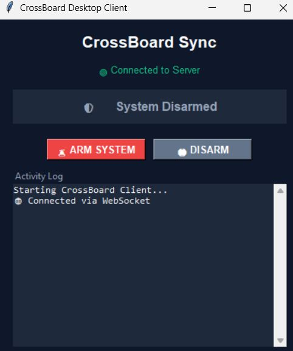

# CrossBoard 🔐

A high-security, self-hosted, real-time Universal Clipboard Synchronization Tool. Sync text and images between your Desktop/Laptop and your Mobile devices without relying on third-party cloud services.



## 🚀 Features
*   **Real-Time Sync**: Uses WebSockets for instant, local network clipboard pushing.
*   **Two-Way**: Copy on Desktop -> Appears on Phone. Upload on Phone -> Copied to Desktop.
*   **Images & Text**: Full support for both plain text and image copies.
*   **Extreme Security "Arming"**: By default, the system ignores all incoming clipboards to prevent accidental leaks of passwords or private messages. You must explicitly click "Arm System" before the server accepts a sync.
*   **Premium UI**: A beautiful, responsive glassmorphism web app that feels like a native application.
*   **Zero Hardcoded Secrets**: Fully environment-variable driven.

---

## 🛠️ Installation & Setup (Local Network)

CrossBoard is designed to run securely on your local Wi-Fi network.

### 1. Prerequisites
*   Python 3.9+ installed on your Desktop/Laptop.
*   A Mobile device connected to the same Wi-Fi network.

### 2. Clone and Setup
```bash
git clone https://github.com/AryanKo/CrossClip.git
cd CrossBoard

# Create a virtual environment
python -m venv venv
# Activate it (Windows)
venv\Scripts\activate.bat
# Activate it (Mac/Linux)
# source venv/bin/activate

# Install dependencies
pip install -r requirements.txt
```

### 3. Configure Security
1.  Copy `.env.example` to `.env`.
2.  Open `.env` and change the `API_SECRET` to a strong, random password.

### 4. Run the System
Double-click `start_crossboard.bat` (on Windows). This will:
1.  Start the FastAPI Server (`main.py`).
2.  Start the graphical Desktop App (`desktop_gui.py`).
3.  Pop open a **QR Code**.

Scan the QR code with your phone. Enter your `API_SECRET` to connect.

## 🛡️ Security Architecture
CrossBoard requires explicit "Arming".
1. Open the Web UI on your phone or PC.
2. Click **🚨 ARM SYSTEM**.
3. Now, whenever you copy text or an image on your PC, it will be securely transmitted to your phone. The system then instantly disarms itself.

For internet-facing deployments, see `security_deployment.md` for Zero-Trust End-to-End Encryption guidelines.
